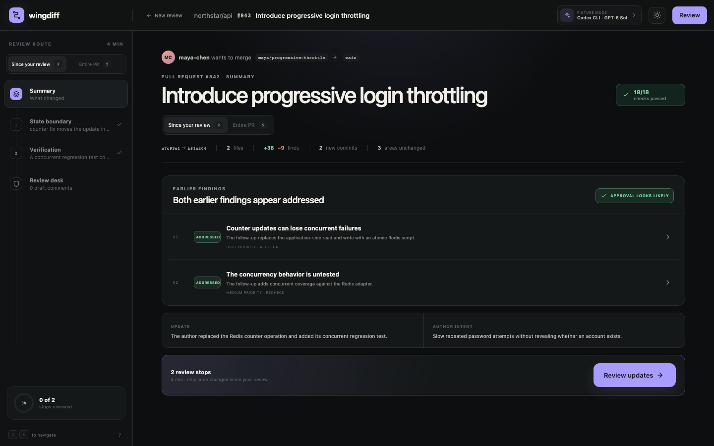

# wingdiff

[](https://github.com/HartBrook/wingdiff/actions/workflows/ci.yml)
[](https://github.com/HartBrook/wingdiff/actions/workflows/codeql.yml)
[](./LICENSE)

Wingdiff is a guided, evidence-backed tour of a pull request. It helps an engineer understand a change by behavior, data flow, and risk; investigate the exact supporting code; and publish a thoughtful review to GitHub.

> [!NOTE]
> Wingdiff is pre-1.0 software under active pilot testing. Review the generated
> evidence and final GitHub payload before publishing.



This repository contains the local-first review foundation described in the [product plan](./PRODUCT_PLAN.md), plus a realistic cross-file fixture for exercising the complete review loop:

- A default **Since your review** route that isolates the two areas changed after the reviewed head
- An **Entire PR** backstop that keeps reviewed-but-unchanged areas visible
- Finding continuity that shows whether earlier concerns still apply or appear addressed
- A focused summary and semantic tour with exact diff evidence
- Line selection, flags, contextual investigation, and draft review comments
- Full evidence Browse mode
- Review desk with coverage, summary, inline comments, and disposition
- Dark/light themes, keyboard navigation, responsive layout, and local persistence

Real pull requests can be acquired, turned into grounded guided tours, and reviewed through GitHub. Review progress, investigation notebooks, comments, the summary, disposition, and submitted-review receipt are persisted locally. The fixture demo still simulates submission. Contextual investigation defaults to the locally installed Codex CLI using its existing ChatGPT sign-in. Direct OpenAI and Anthropic APIs remain optional; the demo uses clearly labeled fixture answers when no provider is available.

## Run locally

### Prerequisites

- [Git](https://git-scm.com/downloads)
- [Node.js](https://nodejs.org/) 22.13+ (excluding Node 23) or Node.js 24+
- [GitHub CLI](https://cli.github.com/) authenticated with `gh auth login` for real pull requests
- [Codex](https://developers.openai.com/learn/codex) CLI authenticated with `codex login` for the default model transport, or an optional direct provider API key

Wingdiff supports macOS, Linux, and Windows. Its server binds to loopback by
default and is not intended to be deployed as a public web service.

### Quick start

```bash
git clone https://github.com/HartBrook/wingdiff.git
cd wingdiff
npm ci
npm run wingdiff -- --demo
```

The launcher starts Wingdiff on a loopback address and opens an authenticated local URL. From a matching local checkout, pass a GitHub pull request URL or number:

```bash
npm run wingdiff -- --demo
npm run wingdiff -- https://github.com/owner/repository/pull/123
npm run wingdiff -- 123 # resolves the repository from the current checkout
```

Wingdiff is currently distributed from source rather than through npm. The
server workspace builds a `wingdiff` binary for future packaged releases. Use
`npm run dev` when developing the UI without automatic browser launch.

### Read-only PR acquisition

For a real pull request, launch Wingdiff from a matching local checkout with an authenticated GitHub CLI:

```bash
gh auth status
npm run wingdiff -- https://github.com/owner/repository/pull/123
```

Wingdiff reads metadata through `gh`, fetches missing objects into private `refs/wingdiff/pull/...` references, and builds the diff from exact pinned base/head SHAs. It does not checkout the PR, modify the worktree or index, or execute pull-request code. Acquired metadata, evidence, generated tours, and review checkpoints are stored in a local SQLite database. Set `WINGDIFF_DATA_DIR` to choose its location.

From the real-PR Summary, choose a configured model and select **Generate guided review**. The model organizes the validated diff into semantic stops, ranks concrete findings by severity, and references opaque evidence anchors. Wingdiff rejects the result unless every changed file is covered and every claim or finding resolves to an exact known anchor. Generated tours are pinned to the acquired head SHA and can be resumed locally.

Before generation, Wingdiff shows the exact model context, provider transport, changed files, repository instructions, exclusions, size, and content fingerprint. Potentially sensitive, generated, and vendor files are marked; common key and environment-file patterns are excluded by default. Exclusions are editable local globs. `AGENTS.md`, `CONTRIBUTING.md`, and `.github/CONTRIBUTING.md` are included when present, capped at 20,000 characters each. Context over 750,000 characters is blocked until reduced.

Comments drafted from a real tour are also pinned to the acquired diff. Wingdiff records the GitHub side and exact line range, verifies the terminal line fingerprint against the canonical pull-request diff, and stores accepted drafts in the local SQLite session. A stale, cross-hunk, wrong-side, or non-diff anchor is rejected before it can enter the review queue.

The real-PR **Review desk** presents the exact summary, disposition, and inline-comment batch before an explicit publish action. Immediately before publishing, Wingdiff rereads the pull request through the authenticated GitHub CLI, blocks a moved or closed head, and revalidates every stored anchor. It then sends one batch review using `commit_id`, `line`, `side`, and optional multi-line coordinates. A successful GitHub receipt is saved locally, and duplicate publication for the same pinned head is blocked. The authenticated GitHub identity needs pull-request write permission to publish.

### Review author updates

After visiting every stop, select **Complete review** to create an explicit checkpoint at the current head SHA. **Check for updates** then reacquires the pull request without checking it out or running its code. If the author pushed a new head, Wingdiff opens a new local session in **Since your review** mode using the exact reviewed-head → current-head diff.

The **Entire PR** scope remains available as an independent backstop. Update and full-PR tours, progress, positions, and completion checkpoints are persisted separately. Previously reviewed areas that do not intersect the update are labeled as reviewed and unchanged. Every acquired revision is retained under a private `refs/wingdiff/pull/.../revisions/...` reference so a later force-push does not erase the comparison baseline.

## Portable, local-first AI

Wingdiff has no hosted service dependency. By default, its loopback server delegates model work to Codex CLI, which keeps authentication in the supported CLI credential store instead of asking Wingdiff to handle a key.

```bash
codex login
codex login status
npm run dev
```

Wingdiff invokes `codex exec` in an isolated temporary directory with an ephemeral session, a read-only sandbox, user/project customization disabled, and a structured-output schema. Review evidence is sent over stdin rather than command-line arguments. The model request still reaches the provider configured by Codex, so your organization’s model and data-use policies still apply.

Direct API access is an optional fallback. Copy the example environment file and add either key:

```bash
cp .env.example .env
```

Available Codex/OpenAI models:

- `gpt-6-sol` — default balance of review quality, speed, and cost
- `gpt-6-astra` — highest-capability option for difficult reviews
- `gpt-6-luna` — fast, cost-efficient investigations
- `gpt-5.3-codex` — Codex-tuned coding model

Claude Sonnet 4.6 and Opus 4.6 remain available through the same provider interface. Select Codex CLI, OpenAI API, or Anthropic API plus the model and supported reasoning effort from the model control in the top bar.

API keys are read only by the loopback Node server and are never returned to browser JavaScript. OpenAI API requests use the Responses API with `store: false`; tour generation uses strict structured output and investigations stream. Wingdiff never reads or copies Codex CLI credentials.

The local server generates a fresh launch token, exchanges it for an HTTP-only, same-site cookie, rejects cross-origin mutations, and refuses non-loopback binding unless `WINGDIFF_UNSAFE_ALLOW_REMOTE=1` is explicitly set. Server discovery files are private to the current OS user and are reused only for the same working directory.

### Configuration

All configuration is optional and is read only by the local Node process.

| Variable | Purpose |
|---|---|
| `OPENAI_API_KEY` | Enable direct OpenAI API access |
| `ANTHROPIC_API_KEY` | Enable direct Anthropic API access |
| `WINGDIFF_CODEX_BIN` | Override the Codex CLI executable |
| `WINGDIFF_CODEX_TIMEOUT_MS` | Override the Codex request timeout |
| `WINGDIFF_DATA_DIR` | Choose the directory containing `wingdiff.sqlite3` |
| `WINGDIFF_HOST` | Override the loopback host |
| `WINGDIFF_PORT` | Override the local port |
| `WINGDIFF_UNSAFE_ALLOW_REMOTE` | Allow a non-loopback host when set to `1`; unsupported and dangerous |

See [`.env.example`](./.env.example) for an annotated template. Never commit
provider keys or expose Wingdiff directly to an untrusted network.

## Verify

```bash
npm test
npm run typecheck
npm run build
npx playwright install chromium # once per machine
npm run test:e2e
```

The tests enforce the product's grounding contract: claims must resolve to real evidence, generated tours must cover every included changed file, diff ranges must be internally consistent, revision coverage must partition the full fixture tour, findings must remain attached to known stops, and staged comments must match the pinned GitHub diff side and line fingerprint. The browser suite drives a mocked real-PR session through context approval, generation, investigation, visible-code comment drafting, persistence, and navigation home.

See [PILOT.md](./PILOT.md) for the first-user runbook and feedback checklist.

## Keyboard shortcuts

| Key | Action |
|---|---|
| `j` / `k` | Next / previous tour stop |
| `a` | Investigate the active evidence |
| `c` | Draft a comment |
| `f` | Flag the current stop |
| `d` | Toggle tour and Browse mode |
| `r` | Open the review desk |
| `Escape` | Close the active overlay |

## Contributing and support

Contributions are welcome. Read [CONTRIBUTING.md](./CONTRIBUTING.md) before
opening a pull request, use [GitHub Discussions](https://github.com/HartBrook/wingdiff/discussions)
for questions and ideas, and use [GitHub Issues](https://github.com/HartBrook/wingdiff/issues)
for reproducible defects. The [product plan](./PRODUCT_PLAN.md) is retained as a
historical design brief rather than a live roadmap.

Please report vulnerabilities privately according to [SECURITY.md](./SECURITY.md)
and follow the [Code of Conduct](./CODE_OF_CONDUCT.md) in all project spaces.

## License

Wingdiff is available under the [MIT License](./LICENSE).
